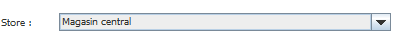

# Store Inventory

L'onglet nous permet de mettre dans les différents magasin les produits dans le stock.

Nous pouvons choisir le Magasin où mettre le stock. (fonction administrateur)

Nous avons la liste de tout les produits créés.

.png>)

La possibilité d'ajouter au magasin ou d'en retirer un..png>)

Et les produits actuellement dans le stock du magasin.

.png>)

Ou de modifier la quantité&#x20;

.png>)

